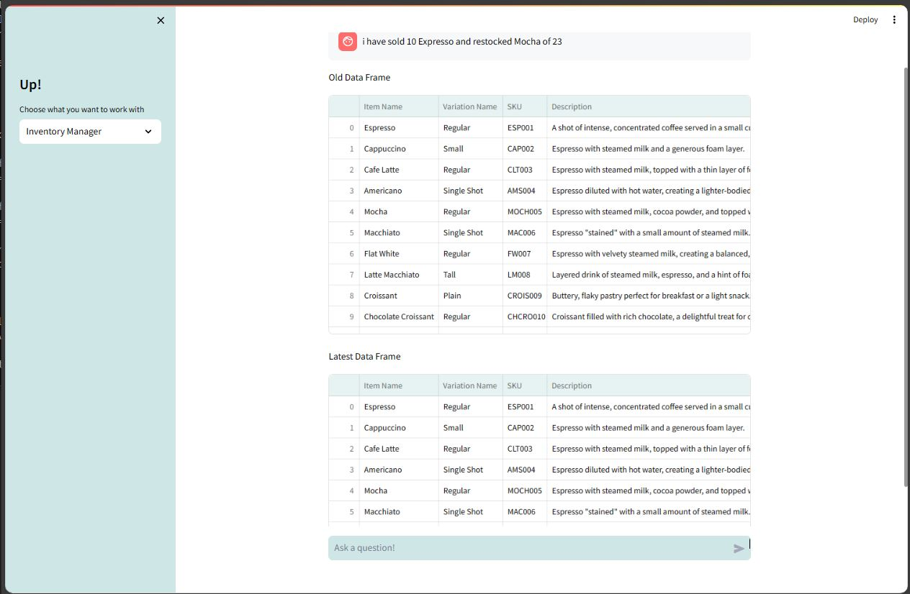
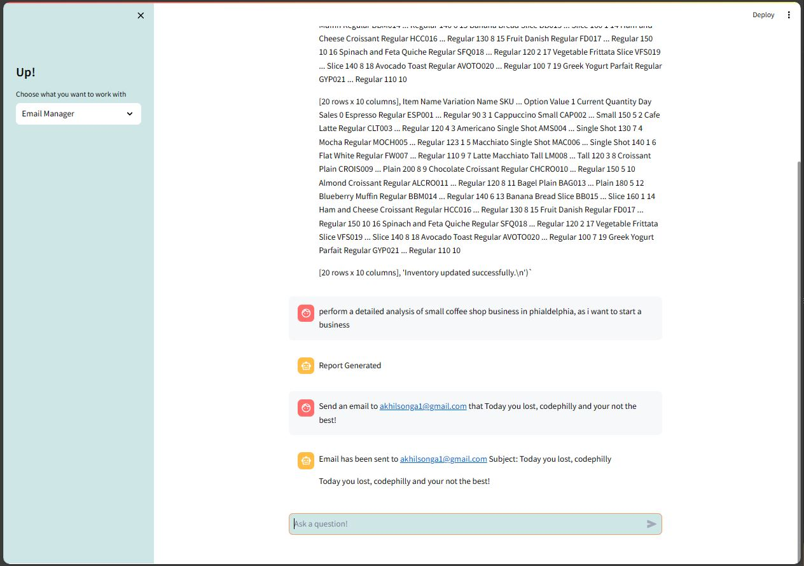
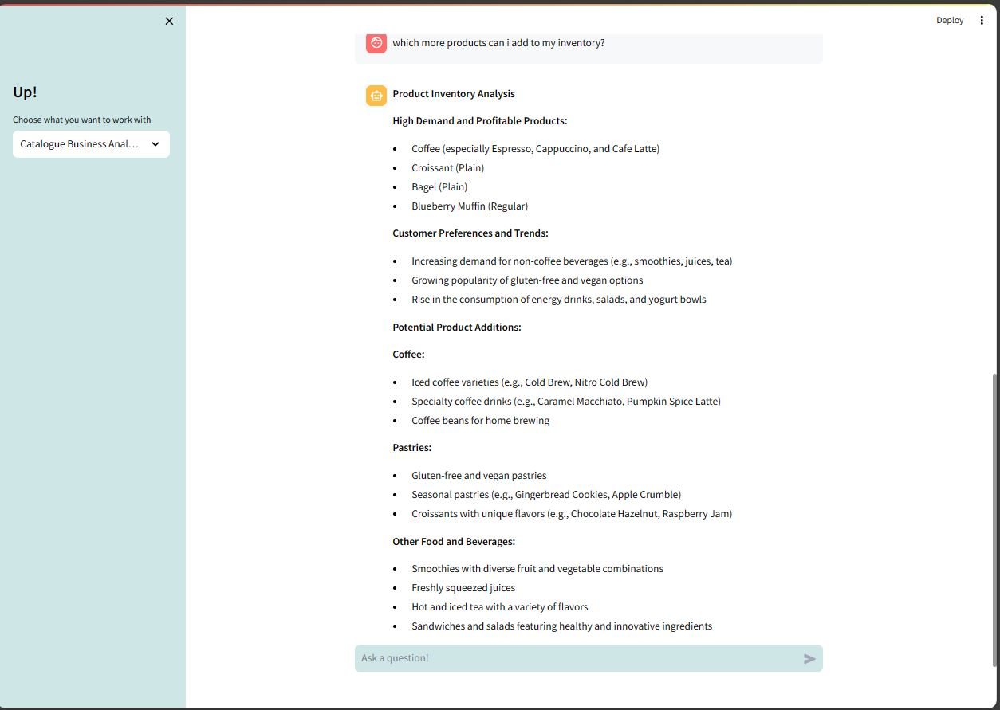

# Up-

Let's Up the game of Underprivileged Business Owners

## Introduction

Up- is a chatbot designed to assist underprivileged business owners in managing their businesses more efficiently. With Up-, you can perform various tasks such as updating inventory, checking sales, analyzing business performance, and sending emails to customers, all through simple queries.

## Features

### Inventory Management

Easily update and check your inventory by simply asking Up- about your stock levels and any changes made, as demonstrated in the examples below:

Example 1:
"I have sold 10 espresso and restocked."

Example 2:
"I have sold 10 espresso and restocked 23 mocha."

### Detailed Business Analysis

Ask Up- to perform a detailed analysis of your small business shop, and it will conduct multiple internet searches about your business and provide you with a comprehensive PDF report. This feature is inspired by and an upgraded version of ReAct LLM Paper.

### Email Communication

Send emails to your customers directly through Up-. Simply provide the subject, and Up- will draft a small email and send it to your customers on your behalf.

### Product Recommendations

Get recommendations on which products to add to your catalogue for better customer service. Up- performs a detailed analysis of your inventory and your competition's products to provide tailored recommendations.

Contributors:

Akhil Songa
Sai Tanmai Naga

