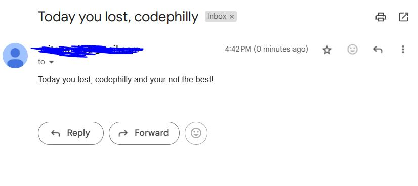

Let's Up the game of Underprivileged Business Owners

## Introduction

Up- is a chatbot designed to assist underprivileged business owners in managing their businesses more efficiently. With Up-, you can perform various tasks such as updating inventory, checking sales, analyzing business performance, and sending emails to customers, all through simple queries.

# UnderPrivileged Business Owner Application

I developed a comprehensive application tailored for underprivileged business owners, enabling them to conduct all operations using natural language. Customization is facilitated through Google Forms.

## AI System Architecture

The AI system comprises multiple agents collaborating to streamline tasks seamlessly. These agents include:

- Inventory Manager
- Internet Surfer
- Report Analyst
- Email Manager
- Catalog Business Analyst

Additionally, there are several other agents operating behind the scenes, such as:

- Python Code Generator and Executor
- Inventory Prompt Expert
- User Query Prompt Expert
- Markdown response Expert
- Youtube Video Analyst

## Functionality Highlights

### Inventory Manager
Automatically handles inventory management tasks, including tracking additions, sales, best-selling items, average performance, and user preferences, all communicated in natural language.

### Catalog Business Analyst
Assists in decision-making by providing insights on potential product additions and product pairings through detailed reports generated from inventory and catalog searches.

### Internet Surfer
Facilitates market research for expanding businesses, gathering data on rent rates, top-selling products, successful businesses in specific areas, brand competitors, average revenue, and more. It generates PDF reports for easy reference or distribution.

### Email Manager
Streamlines email communication by organizing incoming emails and facilitating bulk email sends for tasks such as distributing gift cards or notifying employees about shop closures.

This integrated system aims to alleviate the burden on business owners, enabling them to focus on core operations while leveraging AI-driven automation for efficiency.

## Features

### Inventory Management

Easily update and check your inventory by simply asking Up- about your stock levels and any changes made, as demonstrated in the examples below:

Example 1:
"I have sold 10 espresso and restocked."

Example 2:
"I have sold 10 espresso and restocked 23 mocha."

Example3: 
"Perform a detailed analysis of small business shop at philadelphia, as i want to start a company"
Inspired by ReAct LLM Paper, heavily improved version of it.

### Detailed Business Analysis

Ask Up- to perform a detailed analysis of your small business shop, and it will conduct multiple internet searches about your business and provide you with a comprehensive PDF report. This feature is inspired by and an upgraded version of ReAct LLM Paper.

### Email Communication

Send emails to your customers directly through Up-. Simply provide the subject, and Up- will draft a small email and send it to your customers on your behalf.

### Product Recommendations

Get recommendations on which products to add to your catalogue for better customer service. Up- performs a detailed analysis of your inventory and your competition's products to provide tailored recommendations.

Contributors:
 
Akhil Songa 
Naga Venkata Surya Sai Tanmai Raavi

